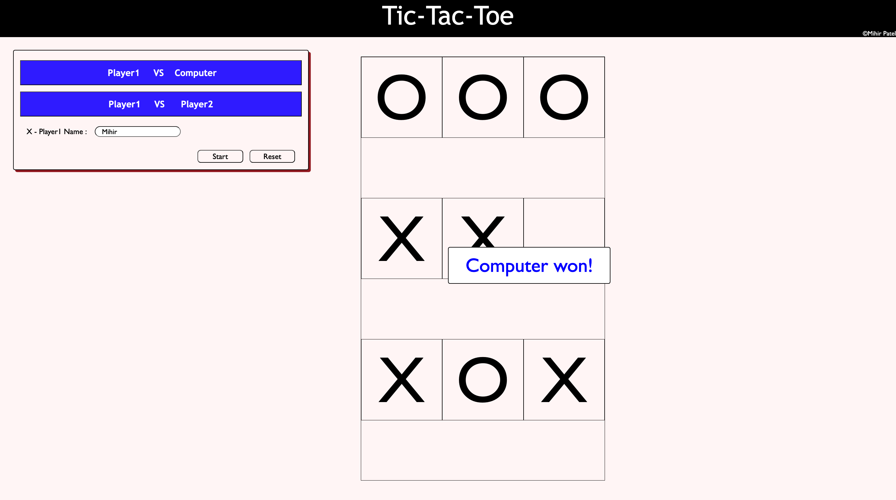

# Tic-Tac-Toe Game

A simple Tic-Tac-Toe game built using JavaScript, HTML, and CSS. This game allows users to play solo against the computer or compete with a friend.

## Features
- Play against a friend or the computer.
- Dynamic UI updates.
- Win and tie detection.
- Simple and interactive user interface.

## Screenshots

## How to Play
1. Choose an option:
   - **Solo**: Play against the computer.
   - **With a Friend**: Play with another player.
2. Enter player name(s).
3. Click "Start" to begin.
4. Take turns clicking on the squares to mark X or O.
5. The first player to align three marks in a row, column, or diagonal wins.
6. Click "Reset" to start a new game.

## Installation
No installation is required. Simply open the `index.html` file in a browser.

## Code Structure
- **index.html**: Contains the game structure.
- **style.css**: Manages game styling.
- **script.js**: Contains game logic, player interactions, and game flow.

## Technologies Used
- HTML
- CSS
- JavaScript (Vanilla JS)

